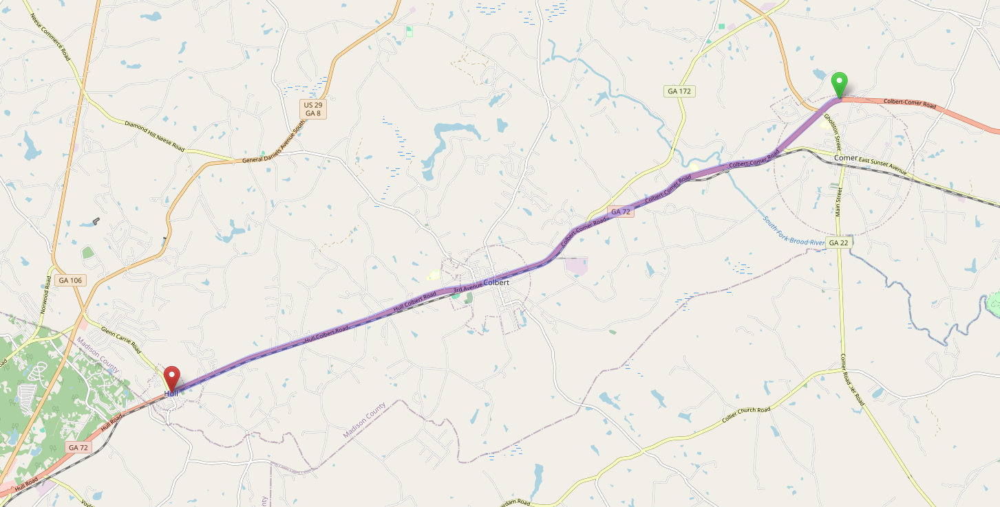
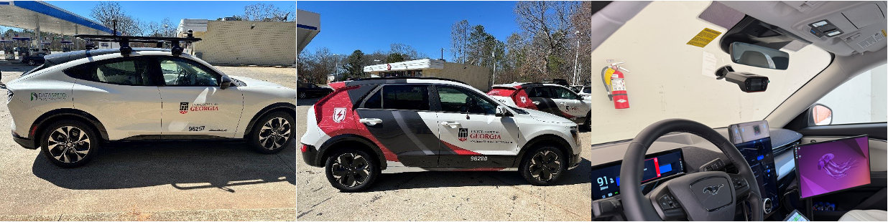

# 🚗 EV Platoon Dataset for OPD/TPD Car-Following Experiments

This repository contains a field-collected electric vehicle (EV) platoon dataset designed to study **car-following behavior under One-Pedal Driving (OPD)**, **Two-Pedal Driving (TPD)**, and **Adaptive Cruise Control (ACC)** under controlled road conditions. The dataset includes synchronized 10 Hz GPS trajectories for one ICE lead vehicle and three following EVs, enabling detailed analysis of spacing, speed, acceleration, and platoon dynamics.

---

## 📥 Download Dataset

The dataset is hosted on Google Drive.

👉 **Dataset Download Link:**  
**[INSERT GOOGLE DRIVE LINK HERE]**

---

## 📍 Data Collection Site

To address research gaps in existing EV datasets, we conducted controlled platoon experiments on a straight, low-traffic segment of **Georgia State Route 72**, near the University of Georgia.  
The roadway was selected for:

- flat and consistent grade  
- clear lane markings  
- minimal surrounding traffic  
- reduced external disturbances  

All experiments were conducted during off-peak hours.

  
   
  <em>Figure 1. Experimental road segment on GA-72 (Source: OpenStreetMap).</em>

---

## 🚘 Vehicle Fleet and Instrumentation

The platoon consisted of **one lead vehicle** and **three following EVs**, all equipped with advanced driver-assistance features.

| Position | Vehicle | Type | Features |
|---------|---------|------|----------|
| Lead | 2021 Lexus UX 200 | ICE | ACC-equipped |
| 2nd | 2024 Ford Mustang Mach-E | EV | OPD + ACC |
| 3rd | 2023 Kia Niro EV | EV | OPD + ACC |
| 4th | 2023 Kia Niro EV | EV | OPD + ACC |

### GPS Measurement

All vehicles were equipped with **RaceBox 10 Hz GPS units**, providing:

- ~10 cm positional accuracy  
- velocity noise ~0.1–0.3 m/s  
- consistent mounting position across vehicles

  
   
  <em>Figure 2. Windshield-mounted RaceBox GPS (left) and following EVs (right).</em>

All drivers were experienced with EVs but **novices to OPD**, which is noted as a dataset limitation.

---

## 🧪 Experimental Design

To isolate the effects of pedal mode and ACC behavior, the study consisted of **12 experiments**, covering the full combination of:

- **Pedal Mode:** OPD vs. TPD  
- **Control Mode:** ACC vs. Manual  
- **Headway Setting:** Longest vs. Shortest (ACC only)  
- **Lead Vehicle Speed Adaptation Rate:** Low vs. High  

### Experiment Summary

| Exp. | Pedal Mode | Control Mode | Headway | Adaptation Rate |
|------|------------|--------------|---------|-----------------|
| 1 | OPD | ACC | Longest | Low |
| 2 | OPD | ACC | Longest | High |
| 3 | TPD | ACC | Longest | Low |
| 4 | TPD | ACC | Longest | High |
| 5 | OPD | ACC | Shortest | Low |
| 6 | OPD | ACC | Shortest | High |
| 7 | TPD | ACC | Shortest | Low |
| 8 | TPD | ACC | Shortest | High |
| 9 | OPD | Manual | N/A | Low |
| 10 | OPD | Manual | N/A | High |
| 11 | TPD | Manual | N/A | Low |
| 12 | TPD | Manual | N/A | High |

---

## 📈 Lead Vehicle Speed Profile

To ensure repeatable oscillation patterns, the lead vehicle followed a predefined dynamic speed trajectory:

1. Accelerate from **0 → 55 mph**  
2. High-speed oscillations  
   - 55–50 mph  
   - 55–45 mph  
3. Transitional deceleration: **55 → 35 mph**  
4. Low-speed oscillations  
   - 35–30 mph  
   - 35–25 mph  
5. Decelerate to stop

This structure enables downstream analysis of oscillation propagation, spacing stability, and pedal-mode-dependent behavior.

---

## 📁 Repository Structure

